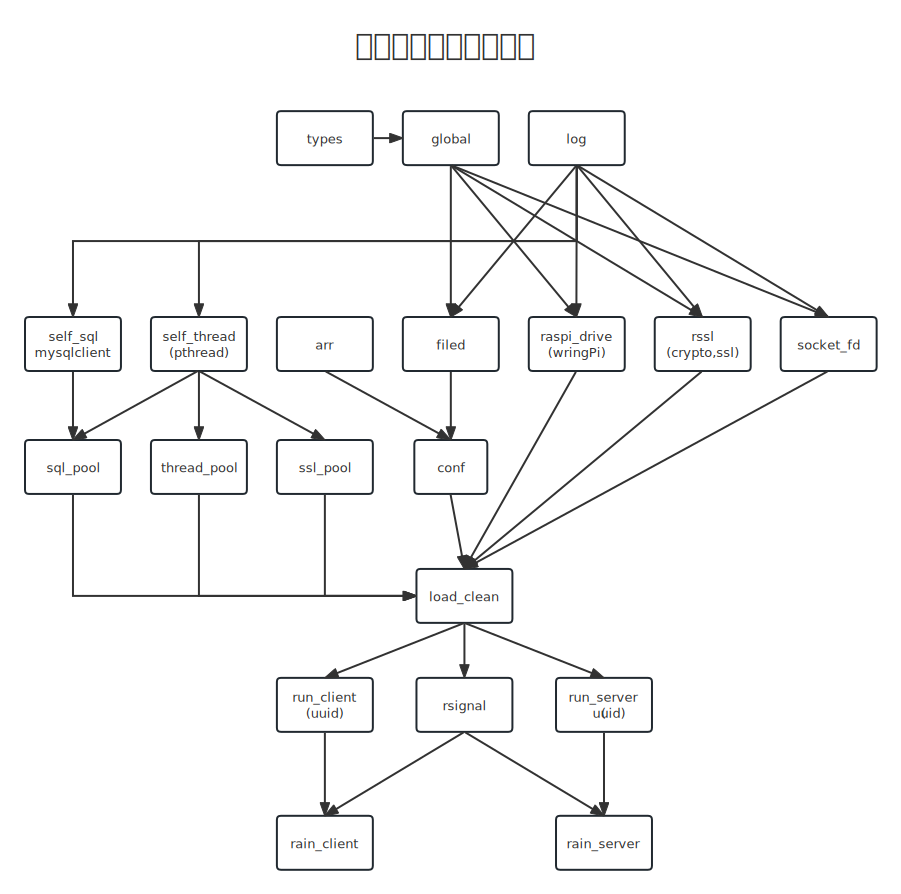
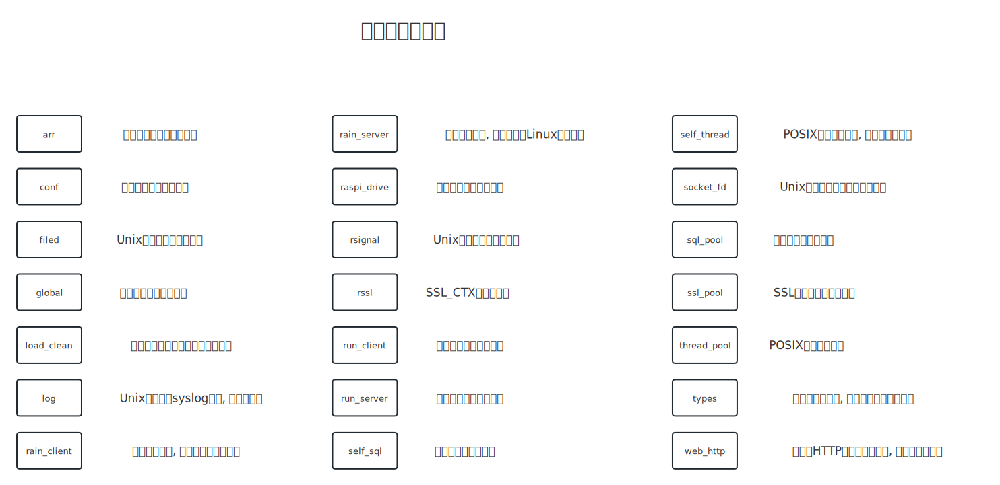

### 自主开发声明

```txt
本工程是本人由于兴趣在大学二,三年级学习了《TCP/IP网络编程 伊圣雨 著》的全部章节
和《UNIX环境高级编程 第三版 W.理查德·史蒂文斯 & 史蒂芬·A.拉戈 著》的部分章节 (第3~5章,第7~16章)
后一点一点手写慢慢调试起来的,非复制粘贴~~~

1.[灵泽] 是我自主独立完成的项目,该项目没有抄袭他人的知识产权,技术或其他方面的资源
2.我对该项目的所有代码,文本和其他内容享有知识产权,并且我保留一切权利
3.该项目使用了以下知名的C语言库 libmysqlclient, libssl, libuuid
4.该项目在实现过程中,没有违反任何知识产权,商业机密,合同或法律法规
5.本项目采用 Academic Free License v3 开源许可证
本声明是我对该项目的真实性,完整性,独立性和自主性的确认和保证
```

### 简介

```text
纯C语言的Linux学习型项目,学习C,网络编程和内核编程的童鞋不要错过哦~
编写于树莓派4b,基于wiringPi库的数据实时检测采集并上传指定服务器的客户端

现实意义: 一种分布式物联网模型, 多客户端传集中服务器
如智能农业农场系统, 智能停车系统, 智能家具, 智能小区物业, 自动浇花, 狗粮/猫粮定时投喂
理论意义: 学习Linux大量库函数和系统调用, 学习纯C语言编程, Linux系统编程, Socket网络编程, MySQL数据库编程, OpenSSL编程, HTTP编程
```

### 没有树莓派? (客户端模拟器)

```text
这意味着您可能无法使用wiringPi库,不过我们贴心地准备了模拟器模式
它们的区别仅仅在于使用模拟器模式后raspi_drive.c文件中原本直接操作物理引脚电平获取数据的方式更改为获取随机数,没有其他影响
模式切换方式: 在CMakeLists.txt文件中找到 "set(SIMULATOR false)",将false更改为true即可
开启了SIMULATOR宏定义后客户端不再要求必须编译运行于树莓派上
```

### 技术栈

```markdown
* 基于wiringPi的传感器硬件的驱动编写
* Linux 二进制I/O, 文件I/O, socket网络I/O, 内存映射
* Linux 常见不稳定的经典信号量的捕捉与处理
* 字符串处理, 单链表, 哈希表实现与应用
* 系统日志syslogd使用, PID锁文件的使用, config配置文件的定义和使用
* mysql 数据库调用, SQL连接池实现与应用
* POSIX线程池实现与应用, 线程同步, 临界区, 读写锁, 互斥量的使用
* OpenSSL的应用, 证书密钥的管理和使用, 加密通信技术支持
* HTTPS的实现, HTTP请求回复报文的组装和拆解, HTML页面设计, CSS美化, Ajax请求
* Linux 五种I/O模型之一"I/O多路复用", epoll 模型的搭建和使用
* 跨函数栈跳转, 客户端软件短线自动重连
* 自定义清理函数的定义和使用, 清理程序生成的数据结构
```

### 安装

```shell
# 使用了cmake工具,操作极其简单
# 如果没有cmake工具或者wiringPi库,自行百度安装

# 下载工程
$ git clone https://gitee.com/Einc/raspi.git

# 编译
$ cd raspi && mkdir build && cd build && cmake .. && make
#或者
$ cd raspi && cmake -B build && cmake --build build

# 安装(可选)
$ sudo make install || sudo cmake --install build
```

### 环境依赖

```shell
# WiringPi 库: https://github.com/WiringPi/WiringPi
# 库依赖 RHEL 系列系统
$ sudo yum install openssl-devel
$ sudo yum install mysql-devel
$ sudo yum install mysql-server
$ sudo yum install libuuid-devel

# 库依赖 DEBIAN 系列系统 (以Raspberry OS 为例)
$ sudo apt install libssl-dev
$ sudo apt install default-libmysqlclient-dev
$ sudo apt install default-mysql-server
$ sudo apt install uuid-dev
```

### 软件的使用

```shell
# 灯光解释:
# 红灯亮起:成功与服务器建立TCP链接
# 绿灯亮起:超声波传感器返回小于30cm(满足物理条件:车位非空闲)
# 黄灯亮起:环境温湿度异常,不适合系统继续运行
# 黄灯闪烁:每闪烁一次表示上传一次数据
# [注意] 请保证客户端和服务器在同一模式运行(不能一个SSL安全连接模式,另外一个普通TCP模式)

# 客户端部署在树莓派上, 服务器端可部署在任意的Linux系统上
$ rain_client --help          # 查看运行参数列表
$ rain_client --settings      # 打开配置文件

$ rain_server --help          # 查看运行参数列表
$ rain_server --settings      # 打开配置文件
```

### 配置文件

```text
服务器软件配置文件: /usr/local/etc/rain_server.conf
客户端软件配置文件: /usr/local/etc/rain_client.conf
# 配置文件优先级小于(主函数)运行参数
# 配置文件书写规则: key = value
# 1.大小写不敏感
# 2.自动忽略空格,双引号,制表符
# 3.注释请用井号开头,可以写行尾注释
# 4.请不要乱写一些非法配置,否则程序可能不能正确运行!
# 5.配置文件优先级小于运行参数!
# 以下是书写范例:
```

#### 服务器配置文件

```yaml
# 指定服务器地址绑定的地址
# 0.0.0.0:     所有网卡网络可见
# 127.0.0.1:   本机网络可见
# 指定网卡地址:  仅特定网卡网络可见
BindAddr = 0.0.0.0

  # 指定服务器绑定的端口号
BindPort = 9190

  # 指定服务器HTTP端口号
HttpPort = 8080

  # SSL模式选择,用于解释客户端如何和服务器连接
  # disable: 禁用SSL连接, 使用TCP明文通信(调试模式优先)
  # default: 加载CA证书,服务器证书密钥, 启用SSL连接
SSLMODE = default

  # 指定CA文件路径
CAFILE = /path/to/ca.crt

  # 指定服务器证书文件路径
SERVCERT = /path/to/server.crt

  # 指定服务器私秘钥文件路径
SERVKEY = /path/to/server.key

  # disable: 禁用PID文件,不检查程序运行的唯一性(调试模式优先)
  # default: 使用默认的文件位置: /var/run/*.pid (推荐)
  # "PID FILE PATH": 自定义pid文件位置(注意: 你可能需要同步手动修改systemd unit文件)
PIDFILE = default

  # disable: 调试模式 
  # default: 守护进程模式 
DAEMON = default

  # 设置 MySQL 服务器
SQLHOST = 127.0.0.1

  # 设置 MySQL 服务端口
SQLPORT = 3306

  # 设置 MySQL 用户名
SQLUSER = root

  # 设置 MySQL 密码 (不建议设置在配置文件里)
SQLPASS = mysql

  # 设置 MySQL 数据库名称
SQLNAME = rain
```

#### 客户端配置文件

```yaml
# 指定服务器地址,IPv4地址和域名都是可以的
ServAddr = 127.0.0.1

  # 指定服务器端口号
ServPort = 1234

  # SSL模式选择,用于解释客户端如何和服务器连接 
  # disable: 禁用SSL连接, 使用TCP明文通信(调试模式优先) 
  # default: 不加载安全文件, 启用SSL连接, 不要求鉴别服务器身份(推荐) 
  # "CA FILE PATH": 加载CA证书, 启用SSL连接, 验证服务器身份(最可靠) 
CAFILE = default

  # disable: 禁用PID文件,不检查程序运行的唯一性(调试模式优先) 
  # default: 使用默认的文件位置: /var/run/*.pid (推荐) 
  # "PID FILE PATH": 自定义pid文件位置(注意: 你可能需要同步手动修改systemd unit文件) 
PIDFILE = default

  # disable: 调试模式  
  # default: 守护进程模式  
DAEMON = default

  # 数据采样间隔,单位: 秒 
Interval = 5
```

### 压力测试软件的使用

```shell
$ multi_client_test <客户端多开数量> <客户端程序路径> [客户按程序运行参数(可选)]
```

### 数据表

```sql
use rain;
create table if not exists raspi
(
    record_id   BIGINT      not null auto_increment primary key,
    record_date DATE        not null,
    record_time TIME        not null,
    client_fd   INTEGER     not null,
    client_uuid VARCHAR(40) not null,
    cpu_temp    FLOAT(2),
    distance    FLOAT(2),
    env_humi    FLOAT(2),
    env_temp    FLOAT(2)
);
```

### 静态库依赖关系



### 静态库列表



### 常见问题

```text
编译时找不到ssl.h,wringPi.h,uuid.h,mysql.h等头文件
    这是缺少了相关库,参见上文
    另外如果你使用的是树莓派,请安装wringPi库,否则请开启模拟器模式

0. 程序运行没结果(直接返回命令行)
    a.推荐查看日志(看下面第三条)
    b.程序没有运行起来(看下面第一条)
    c.变成了守护进程
    
1. 程序跑不起来:
    a.检测配置文件是否正确配置,其中服务器端口和地址是必须指定的
    b.查看pid文件 /var/run/*.pid 是否存在
        你看到了pid文件当且仅当:
        I.  已经有相同客户端程序在运行,使用 ps aux | grep rain 命令找出它的PID,并使用 sudo kill -INT <PID>即可
        II. 没有程序运行(一般是上一次运行时被暴力结束了,因此遗留文件未删除),这时直接删掉文件即可; 
            pid文件在程序启动时自动创建,终止时自动删除.因此一般情况下,您无需手动操作
        
2.  错误提示: "System has not been booted with systemd as init system (PID 1). Can't operate."
    即 systemd 用不了(sudo systemctl start/stop/enable/disable/status... rain_server/rain_client)
    
    造成这种原因可能是您的程序运行在没有完整独立内核和完全的系统调用的Linux虚拟化平台上,比如 WSL1 (Windows Subsystem For Linux Version.1)
    当然也可以自行百度 "WSL开启systemctl"
    否则在这种情况下,直接手动执行可执行文件即可,并且您没有必要 "make install" 了(根本无法使用systemd)
    
3. 不清楚程序现在是什么状态
    我们会将关键步骤和出错信息写入系统日志(facilities: daemon)
    正常情况下,直接打开/var/log/daemon.log即可看见,如果没有该文件,您可以:
        a. sudo vim /etc/rsyslog.conf
        b. 添加:
                    "daemon.*                        -/var/log/daemon.log"
           后保存并退出
        c. 重启系统或者 sudo systemctl restart rsyslog 即可
        d. 看不懂自行百度 "rsyslog日志输出"相关内容
        
4. 跨设备通讯时两端都成功运行起来了,但是无法建立连接
    a. 保持端口一致,建议使用数值大一点的端口,避免端口冲突
    b. 查看目标网络是否是可达的
    c. 使用云服务器的童鞋记得在安全组面板里面放行端口
    d. 检查防火墙(iptables,firewalld)等设置
    
5. 最后来个小提示:
    客户端程序虽然可以自动复位, 如果长时间没有成功连接服务器, 指数补偿至128秒以后就自动退出了
```